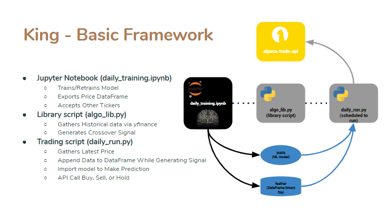
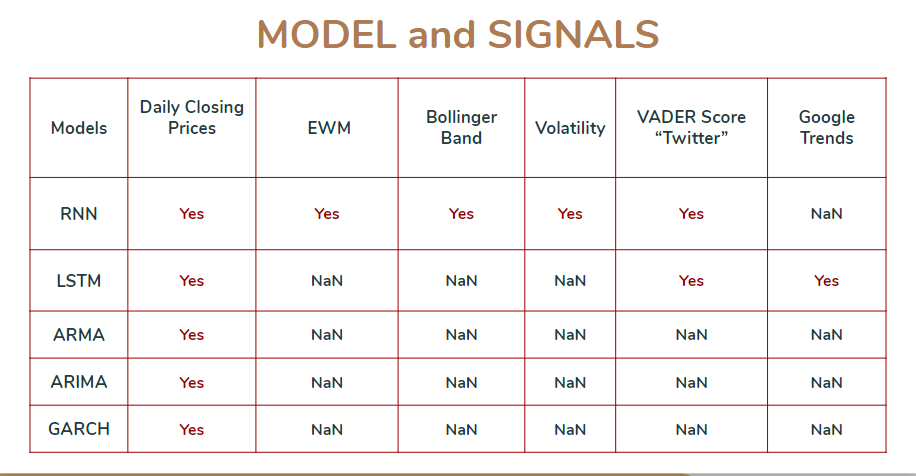
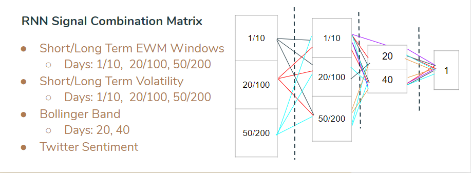
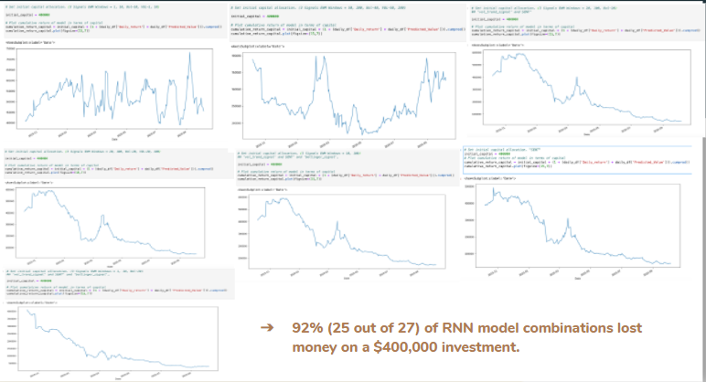
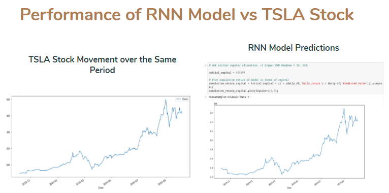

# Algorithmic Trading System Repository

## Installation

Installation
npm install --save react-stockcharts

npm install -g wscat

pip install bta-lib

## Introduction

### General
Group Two started this project with the ambition to construct a software service that leverages the knowledge acquired thus far in the Columbia FinTech Boot Camp. A complete trading system based on the lessons would fortify the understanding of the material from the modules and lead Group Two to exciting new opportunities for composing high-value products.  Group Two aims to compose a profitable trading system using the lessons learned on leveraging application programming interfaces (APIs), statistical models, technical analysis indicators, and artificial intelligence. 
The introduction discusses in broad terms the components in building such a system. Each component will receive a summary in this introduction. The introduction aims to provide an understanding to the reader in terms of the general approach. For data (closing prices) and execution, Group Two used real-time data from an API. In terms of technical analysis and signals, Group Two aimed to compose buy-hold-sell signals (Bollinger Bands, etc.) from indicators. Then, Group Two placed these signals through statistical models (RNN, etc.).
This system requires several components for modeling. One component consists of leveraging the alpaca.com API for real-time information. Another component consists of composing autoregressive moving average (ARMA), autoregressive integrated moving average (ARIMA), and generalized autoregressive conditional heteroskedasticity (GARCH) statistical models for the price of TESLA stock. Furthermore, another component consists of coding the existing technical analysis indicators: Bollinger Band, Exponential Weighted Moving Average (EWM), Volatility Indicator. Yet another component consists of coding technical analysis indicators such as EWM, Bollinger Bands, and the volatility index for composing buy-hold-sell signals for TESLA stock. One other component consists of taking transcripts of TESLA meetings and tweets by the TESLA CEO, Elon Musk, leveraging Natural Language Processing (NLP) and Valence Aware Dictionary sEntiment Reasoning (VADER), and forming an additional buy-hold-sell signal. Yet another component consists of making a signal from Google Trends. Another component consists of taking all of the buy-hold-sell signals and placing them through a recurrent neural network (RNN). Yet another component consists of taking all of the buy-hold-sell signals and placing them through a long short term memory (LSTM) model. 

#### API
Group Two used the alpaca.com API for stock prices and for the trading interface(https://alpaca.markets). One source that Group Two used to leverage this site was https://www.youtube.com/watch?v=9R7pCh4yCm8&t=627s. Another source that Group Two leveraged was https://youtu.be/GsGeLHTOGAg. Group Two also registered at https://polygon.io. Furthermore, in terms of the establishment of dataframes and data cleaning, Group Two used the resources from https://github.com/rrag/react-stockcharts https://pandas.pydata.org/pandas-docs/stable/reference/api/pandas.DatetimeIndex.dayofweek.html.

#### Technical Analysis Indicators
Group Two leveraged code from https://github.com/mementum/bta-lib and from https://github.com/bukosabino/ta in the composition of the technical analysis indicators.

##### Bollinger Band
One may consider a Bollinger Band as an indicator “defined by a set of trendlines [set] two standard deviations (positively and negatively) away from a simple moving average (SMA) of a security's price” (https://www.investopedia.com/terms/b/bollingerbands.asp). The Bollinger Band has also been described as “envelopes” that are set “at standard deviation level above and below a simple moving average of the price” (https://www.fidelity.com/learning-center/trading-investing/technical-analysis/technical-indicator-guide/bollinger-bands). Also, it has been stated that the Bollinger Band helps to “determine whether prices are high or low on a relative basis” (https://www.fidelity.com/learning-center/trading-investing/technical-analysis/technical-indicator-guide/bollinger-bands). The Bollinger Band was invented by John Bollinger (https://www.bollingerbands.com/). 

##### Exponentially Weighted Moving Average (EWM)
One can consider the Exponentially Weighted Moving Average (EWM) as a measure of volatility in price (https://www.investopedia.com/articles/07/ewma.asp). The EWM may be seen as a lagging indicator and descriptor of trends, but use of the EWM may help determine optimal entry positions and also may help to identify support and resistance (https://ewminteractive.com/exponential-moving-average-explained). Group Two used different combinations of window lengths to arrive at a crossover strategy (https://tradingstrategyguides.com/exponential-moving-average-strategy/). 

##### Volatility Trend Signal
Group Two used a Volatility Trend Signal from the technical analysis library. It has been stated that “volatility-based indicators are valuable technical analysis tools that look at changes in market prices over a specified period of time… The faster prices change, the higher the volatility… The slower prices change, the lower the volatility…” (https://www.tradingview.com/scripts/volatility/). High volatility creates “buying opportunities” and an “exceptional trading ground” (https://www.investopedia.com/ask/answers/032715/which-market-indicators-reflect-volatility-stock-market.asp). In addition, volatility indicators may indicate trading momentum (https://pdfs.semanticscholar.org/1210/3afd2286e0b5c2fe28993eabdb045126c816.pdf). Group Two used a signal that comes from levaraging multiple windows, like for the EWM indicator.

##### Natural Language Processing (NLP) and Valence Aware Dictionary sEntiment Reasoning (VADER)
Group Two leveraged transcripts from TESLA conference calls and tweets by Elon Musk for analysis by Natural Language Processing (NLP) and Valence Aware Dictionary sEntiment Reasoning (VADER). As done by previous scientists, Group Two assigned scores (https://towardsdatascience.com/sentimental-analysis-using-vader-a3415fef7664). These scores were divided among three values: -1, 0, 1. It was the intent of Group Two to compose a sentiment analysis and to determine meaning as in previous models (https://www.geeksforgeeks.org/python-sentiment-analysis-using-vader/). Group Two used the tweets from Elon Musk at https://www.kaggle.com/vidyapb/elon-musk-tweets-2015-to-2020. One could make the case that natural language processing (NLP) serves fundamentally to provide measurable meaning to words, phrases, idioms, sentences, and larger language structures (https://export.arxiv.org/ftp/arxiv/papers/1902/1902.00679.pdf). The idea is to provide scores to language structures based on criteria (https://nlp.stanford.edu/sentiment/). One could state that this process essentially is how a computer program turns "feelings into data" (https://digital.hbs.edu/platform-rctom/submission/turning-feelings-into-data-applying-natural-language-processing-to-employee-sentiment/). Group Two used NLP and VADER to determine a sentiment score of -1, 0, or 1. In the case of multiple tweets given on one day, the average was taken for a single score. Weekend tweets were omitted because of the extra time provided for the market to adjust to the weekend tweet.

##### Google Trends
Group Two evaluated the search results for “Elon Musk” and “TESLA” on Google Trends. Google Trends provides data on terms that are entered into the Google search engine (trends.google.com). This service also provides geographical and temporal data (https://trends.google.com/trends/explore?date=all&geo=US&q=%2Fm%2F02xmb). In addition, Google Trends has been put forth as a possible tool to predict price (https://seekingalpha.com/article/4191521-using-google-trends-to-predict-stocks). 

The time series analysis describes the main forecasting models: autoregressive moving average (ARMA), autoregressive integrated moving average (ARIMA), generalized autoregressive conditional heteroskedasticity (GARCH). For the regression analysis, the root mean squared error (RMSE) for a model was compared in terms of out-of-sample/test data and in-sample/trainer data. The general conclusion covers the conclusions from the points in this readme file. 

#### Models

##### ARMA
The autoregressive moving average (ARMA) is used in financial forecasting (http://people.brandeis.edu/~blebaron/classes/fin250a/regression/arma.html). It has been stated that in general, ARMA models work best on stationary data (http://www-stat.wharton.upenn.edu/~stine/insr260_2009/lectures/arma_forc.pdf). ARMA models may be enriched with extra data points (https://www.bauer.uh.edu/rsusmel/phd/ec2-4b.pdf).  

##### ARIMA
One may consider autoregressive integrated moving average (ARIMA) to be "the most general class of models for forecasting a time series" (https://people.duke.edu/~rnau/411arim.htm). A case may be made for ARIMA being useful in determining short-term financial data (https://citeseerx.ist.psu.edu/viewdoc/download?doi=10.1.1.911.715&rep=rep1&type=pdf). ARIMA has been compared to other financial modeling systems favorably (http://arxiv-export-lb.library.cornell.edu/pdf/1911.09512). 

##### GARCH
Generalized autoregressive conditional heteroskedasticity (GARCH) models may be used to predict volatility (https://ocw.mit.edu/courses/mathematics/18-s096-topics-in-mathematics-with-applications-in-finance-fall-2013/lecture-notes/MIT18_S096F13_lecnote9.pdf). In addition, GARCH models have grown in favor in terms of analyzing time series data (https://www.stern.nyu.edu/rengle/GARCH101.PDF). GARCH models tend to distinguish themselves through their “randomly varying volatility” (https://faculty.washington.edu/ezivot/econ589/ch18-garch.pdf).

##### RNN
Group Two used the recurrent neural network (RNN) to model. A neural network may be defined as a distinct “name for an approach to artificial intelligence” (https://news.mit.edu/2017/explained-neural-networks-deep-learning-0414). RNNs distinguish themselves in that they “are fit to data using backpropogation” (https://bair.berkeley.edu/blog/2018/08/06/recurrent/). Recurrent neural networks in general may have different structures and applications (https://www.cs.toronto.edu/~tingwuwang/rnn_tutorial.pdf).  

##### LSTM
Also, one can consider the long short term memory (LSTM) recurrent neural network (RNN) as a methodology that "allows learning of long-term dependencies" (http://pages.cs.wisc.edu/~shavlik/cs638/lectureNotes/Long%20Short-Term%20Memory%20Networks.pdf). LSTM RNNs have been leveraged for predictive financial models (http://cs230.stanford.edu/projects_fall_2019/reports/26254244.pdf).  LSTM distinguishes itself in that its network can remember both short term and long term values (http://arxiv-export-lb.library.cornell.edu/pdf/1911.13288).

## Approach

Group Two used several different tools for the project: Jupyter Notebook, Google Colaboratory, jarvis Python file, .feather file, .joblib file. Ultimately, Group Two chose to submit Jupyter Notebooks. In terms of the novel library, Group Two leveraged the TA-Lib Technical Analysis Library at https://ta-lib.org/. 

The diagram directly above illustrates the general approach of Group Two. Group Two chose Jupyter Notebooks to train and retrain the model. Also, Group Two exported the price dataframe with Jupyter Notebooks. In addition, Group Two used Jupyter Notebooks to accept other tickers. In terms of the additional ML library, the Library Script (algo_lib.py) gathers historical data via the pyfinance library and generates a crossover signal. The trading script, (daily_run.py) gathers the latest price, appends data to the dataframe while generating a signal, imports the model to make a prediction, and makes the API call either to buy, to sell, or to hold.

The diagram directly above shows a graphic that provides the best description of the approach. Group Two looked for the best trading system by comparing trading models from signals. These signals, in turn, were formed by technical analysis indicators and by NLP. The use of these models serves as a de facto backtest for each model.

The diagram directly above shows the RNN combination matrix through which Group Two made the attempt to find the most profitable model. 

The diagram directly above illustrates how many models were not profitable.

The diagram directly above shows the model that Group Two ultimately used.

## Results

Group Two was able to find a potentially profitable model with the methodology. The model is illustrated at https://github.com/klleung72781/fintech_project_2/blob/main/TRADING_MODEL.ipynb. In terms of indicators used, this model results from the use of a single signal, the EWM with windows equal to 50 and 100.

## Conclusions

One may draw as a conclusion from this project that it is possible to establish a trading system with an endogenous trading model that may generate profit. Furthermore, given the results, one may also gather that combinations of indicators and models may themselves serve as useful indicators for the prediction of prices and movements of prices. Group Two successfully composed a system trades automatically based on generated models from coded signals, but this system may provide further value as a tool for what is possible. It is worthy to note that the models could be iterated multiple times.

## Future Pursuits

Given extra time, Group Two would have developed the project even further with at least three extra endeavors: 1) development of ability to conduct trades on the one minute timeframe, 2) developing user activity and capability on the dashboard, 3) development of parent artificial intelligence system that explores every single combination of use of indicators. In terms of the ability to conduct trades on the one minute timeframe, a trading platform that offers the option of placing trades whenever possible would provide the most value. Also, in terms of further development of user activity, the current abilities provide promise for the system, and more capabilities and options would draw more users. With more time, Group Two could probably benefit most from developing an artificial intelligence system for the models themselves. Such a system would consider each and every combination of the trading from each and every technical analysis indicator and provide the complete range of possible outcomes.

## Description of Files

1. The “.ipynb_checkpoints” folder holds the standard Jupyter checkpoints.
2. The jarvis folder holds Python files needed for execution of the system.
3. The pycache folder holds a file with the title of “algo_lib.cpython-37.pyc.”
4. The images folder shows a file labeled “daily_trade_screenshot.PNG.”
5. The folder marked “transcripts” hosts python files that demonstrate the use of transcripts of TESLA conference calls from the seeking alpha website.
6. AAPL_daily.feather-This feather file has the “AAPL_daily” categorization.
7. AAPL_daily.joblib-This joblib file has the “AAPL_daily” categorization.
8. AAPL_hourly.joblib-This joblib file has the “AAPL_hourly” categorization.
9. ALGO%20TRADING%20FOR%20STOCKS.pdf-This pdf holds the group presentation.
10. ARMA_VOL1.ipynb-This file is a Jupyter notebook that holds ARIMA and GARCH models.
11. DOMO_daily.feather-This file is a feather file with the categorization “DOMO_daily.”
12. DOMO_daily.joblib-This file is a joblib file with the categorization “DOMO_daily.”
13. F_daily.feather-This file is a feather file with the categorization “F_hourly.”
14. F_hourly.joblib-This file is a joblib file with the categorization “F_hourly.”
15. Google%20Trends%20Tesla_Elon_Musk.ipynb-This file gives a plot of the comparison of TESLA and Elon Musk searches on Google Trends. 
16. NLP.ipynb-This file is the “NLP TWEET FINAL UPLOAD” Jupyter file.
17. OKTA_daily.feather-This file is the “feather” file for the OKTA_daily values.
18. OKTA_daily.joblib-This file is the joblib file for the OKTA_daily values.
19. README.md-This readme file contains the text for the project.
20. TESLA_RNN_MODEL.ipynb-This Python notebook contains TESLA trading signal features.
21. TESLA_VS_ELON.csv- This file is a comma separated value (CSV) of with figures for “TESLA” and “ELON MUSK.”
22. TRADING_MODEL.ipynb-This Python notebook contains a TESLA trading model.
23. TRENDS.csv-This file is a comma separated value (CSV) of trends.
24. TSLA_DATE_CLOSE.csv-This file is a comma separated value (CSV) of TSLA_DATE_CLOSE.
25. TSLA_RAN%20.csv-This file is a comma separated value (CSV) of TSLA_RAN.
26. TSLA_RNN_MODEL.ipynb-This file was created using Google Colaboratory. 
27. TSLA_TA.ipynb-This file shows changes in TSLA according to different indicators such as Donchian Channels and the Ichimoku Kinko Hyo indicator.
28. TSLA_daily.feather-This file supports the daily close model.
29. TSLA_daily.joblib-This joblib file has a daily close model.
30. algo_lib.py-This file codes a crossover signal 
31. clean_twitter.csv-This file is a comma separated value (CSV) file with twitter scores for different dates.
32. daily_run.py-This file has the arguments that initialize the trading decision, the signal, and the order acceptance.
33. daily_training.ipynb-This Jupyter notebook provides a daily trading model.
34. jarvis.py-This file is a jarvis file.
35. random1_forest_model.joblib-This file is the joblib file for the random forest model.
36. sentiment_analysis_TESLA.ipynb-This python notebook collected news about Elon Musk and assigned sentiment scores.
37. tweet_date_df.csv-This comma separated value (CSV) file provides the final scores for the tweeting of the day; scores are either -1, 0, or 1.
38. consisting of associated graphic PNG files for the readme file.

###### NB - Some material and sources may have been reused from previous assignments. Also, most of the ideas were taken from class and teaching services. Furthermore, the Group Two apologizes for any unintentional omission of sources. The University of Toronto image is from http://www.cs.toronto.edu/~hinton/absps/RNN13.pdf.